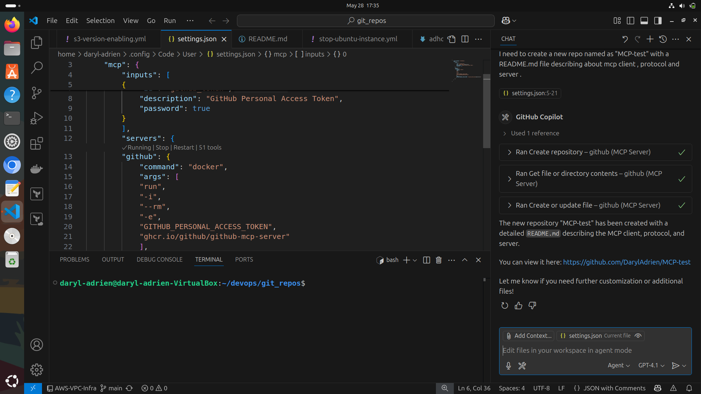

# MCP Demo – GitHub Copilot & MCP Server Integration

This project demonstrates the use of **MCP (Model Context Protocol)** to enable communication between a client (powered by GitHub Copilot) and the official GitHub MCP server. The goal of this demo is to illustrate how MCP can be used to perform real tasks programmatically using Copilot and the MCP protocol.

## 🔍 What is MCP?

**MCP (Model Context Protocol)** is an experimental protocol developed by GitHub to enable AI models (like Copilot) to interact with external tools and services in a secure and structured way.

### 🧩 Components of MCP

- **MCP Server**: A pre-built server (hosted by GitHub) that exposes tool interfaces and handles requests from clients using the MCP protocol.
- **MCP Client**: An interface that allows models (such as Copilot) to interact with the MCP server. It sends tool invocations and receives structured responses.

## 📦 Demo Overview

In this demo, I used GitHub’s official MCP server and the Copilot-integrated client to perform the following task:

- **Create a new GitHub repository** named `mcp-test`.
- **Write a simple `README.md`** file inside that repository using Copilot and MCP tools.

> **Repository Link**: [https://github.com/DarylAdrien/MCP-test](https://github.com/DarylAdrien/MCP-test.git)  

The **MCP server** is provided in the `setting.json` file.

## 🚀 How It Works

1. The **MCP client** (Copilot) initiates communication with the **GitHub MCP server**.
2. The model is provided with tool context (e.g., GitHub API).
3. Copilot generates a request (e.g., create a repo) using the defined tool interface.
4. The MCP server authenticates, processes the request, and returns a structured response.
5. The client (Copilot) interprets the result and continues the workflow as needed.

## 🧠 What I Learned

- Gained hands-on experience with how **Copilot can be extended using the MCP protocol**.
- Understood the **MCP architecture** and how model-to-tool communication is securely handled.
- Learned how to invoke **real-world GitHub operations** like repo creation using an AI-powered workflow.
- Observed the potential of **integrating AI models with external tools** to automate development tasks.

## 📚 Resources

- [GitHub MCP Documentation](https://github.com/github/github-mcp-server)
- [GitHub Copilot](https://github.com/features/copilot)

---

_This demo helped me explore the potential of MCP in building intelligent, automated, and interactive development tools using AI models like GitHub Copilot._

